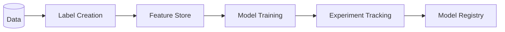

# Snowflake MLOps Hands-on Lab
## 顧客チャーン予測

[](https://www.snowflake.com/)
[](https://www.python.org/)
[](https://xgboost.readthedocs.io/)

## 📌 概要

このハンズオンラボでは、架空の小売会社「Snow Retail」の顧客データを使用し、
顧客チャーン（離反）予測モデルを構築しながら、SnowflakeのMLOps機能を体験します。

データからチャーンを定義し、ラベルを作成するMLの基本ステップから始め、
Feature Store、Model Registry までの一連のワークフローを学びます。

**Notebookはコンピュートプール（コンテナランタイム）で動作** - 起動が早く、コスト効率が良いです。

## 🎯 ハンズオンの目的

- Snowflake NotebookでのPythonによる機械学習ワークフローの体験
- データからラベルを定義・作成するMLの基本ステップの理解
- Snowflake **Feature Store** による特徴量の一元管理と再利用
- Snowflake **Experiment Tracking** による実験の効率的な管理と比較
- Snowflake **Model Registry** によるモデルのバージョン管理とデプロイ

## 📊 使用データ

**リポジトリ内のCSVファイル**（GitHub経由でロード）

| テーブル | 説明 | レコード数 |
|---------|------|-----------|
| CUSTOMERS | 顧客マスタ | 3,000 |
| ORDERS | 注文データ | 約20,000 |

※ チャーンラベルはNotebook内で作成します

## 🎭 シナリオ

> あなたは小売会社「Snow Retail」のデータサイエンティストです。
> 
> **2024年前半**のデータを分析し、**2024年後半**に離反する顧客を予測したいと考えています。

### チャーンの定義

> **2024年前半（1-6月）に注文があったが、2024年後半（7-12月）に注文がなかった顧客**

| 期間 | 用途 |
|------|------|
| 2024年前半（1-6月） | 特徴量計算（この期間の行動を分析） |
| 2024年後半（7-12月） | チャーン判定（この期間に注文なし＝離反） |

## 📁 ハンズオン構成

```
mlops_snowflake_handson/
├── setup/
│   ├── setup.sql                      # 環境構築（オールインワン）
│   └── cleanup.sql                    # クリーンナップ
├── notebooks/
│   ├── 01_data_exploration.ipynb      # データ探索 + チャーンラベル作成
│   ├── 02_feature_store.ipynb         # 特徴量ストア
│   ├── 03_model_training.ipynb        # モデル学習 + CV + SHAP
│   ├── 04_experiment_tracking.ipynb   # 実験管理（複数モデル比較）
│   └── 05_model_registry.ipynb        # モデル登録・本番デプロイ
├── data/
│   ├── customers.csv                  # 顧客マスタ
│   └── orders.csv                     # 注文履歴
└── docs/
    └── handson_guide.md               # 詳細ガイド
```

## 🔄 MLOpsワークフロー



| Section | 内容 |
|---------|------|
| **1. Data Exploration** | データ探索 + チャーンラベル作成 |
| **2. Feature Store** | Entity, FeatureView, v1→v2 バージョン管理 |
| **3. Model Training** | XGBoost, CV, Feature Importance, SHAP |
| **4. Experiment Tracking** | 複数Run比較, メトリクス記録 |
| **5. Model Registry** | バージョン管理, 本番デプロイ, SQL推論 |

## ⏱️ 所要時間

| セクション | 内容 | 主なトピック | 時間 |
|-----------|------|-------------|------|
| 事前準備 | SQLスクリプト実行 | 環境構築、データロード | 10分 |
| Section 1 | データ探索 | EDA、チャーン定義・ラベル作成 | 15分 |
| Section 2 | Feature Store | Entity, FeatureView, v1→v2 | 20分 |
| Section 3 | モデル学習 | XGBoost, CV, ハイパラチューニング, SHAP | 20分 |
| Section 4 | Experiment Tracking | 複数モデル比較、パラメータ管理 | 15分 |
| Section 5 | Model Registry | 登録、v1→v2、SQL推論 | 10分 |
| **合計** | | | **約90分** |

## 🚀 クイックスタート

### 1. 環境構築（Snowsightで実行）

```sql
-- GitHubから setup/setup.sql をコピーして実行（これだけ！）
-- Git統合、DB作成、データロード、Notebook作成がすべて完了します
```

### 2. ハンズオン実行

Snowflake Notebookを順番に実行:

1. `01_DATA_EXPLORATION` - データ理解 + チャーンラベル作成
2. `02_FEATURE_STORE` - 特徴量の設計・登録
3. `03_MODEL_TRAINING` - モデル学習
4. `04_EXPERIMENT_TRACKING` - 実験管理
5. `05_MODEL_REGISTRY` - モデル登録・本番活用

## 📋 前提条件

- Snowflakeアカウント（トライアルアカウント可）
- ACCOUNTADMIN または必要な権限

## 🔑 学習できるMLOpsスキル

| 機能 | 学習内容 |
|------|---------|
| **Data Exploration** | チャーン定義の決定、ラベル作成 |
| **Feature Store** | Entity, FeatureView, バージョン管理(v1→v2) |
| **Model Training** | XGBoost, クロスバリデーション, SHAP値 |
| **Experiment Tracking** | 実験の記録・比較・最適モデルの選択 |
| **Model Registry** | モデルの登録・バージョン管理(v1→v2)・SQL推論 |

## 📈 期待される成果

ハンズオン完了後、以下が構築されます:

- ✅ 定義・作成したチャーンラベル
- ✅ Feature Store に登録された特徴量（v1, v2）
- ✅ 複数の実験記録
- ✅ Model Registryに登録されたモデル（v1, v2）
- ✅ チャーンリスク顧客リスト（リテンション施策対象）

## 🔗 参考リンク

- [Snowflake ML Overview](https://docs.snowflake.com/en/developer-guide/snowflake-ml/overview)
- [Snowflake Feature Store](https://docs.snowflake.com/en/developer-guide/snowflake-ml/feature-store/overview)
- [Snowflake Model Registry](https://docs.snowflake.com/en/developer-guide/snowflake-ml/model-registry/overview)
- [Snowflake ML Experiments](https://docs.snowflake.com/en/developer-guide/snowflake-ml/experiments)
