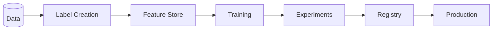
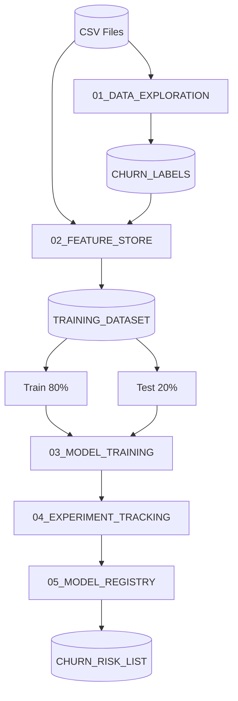

# Snowflake MLOps ハンズオンガイド
## 顧客チャーン予測

---

## 📌 このガイドについて

このドキュメントは、Snowflake MLOpsハンズオンラボの詳細ガイドです。
各セクションの目的、手順、学習ポイントを説明します。

---

## 🎯 全体像



| Section | 内容 |
|---------|------|
| **1. Data Exploration** | データ探索 + チャーンラベル作成 |
| **2. Feature Store** | Entity, FeatureView, v1→v2 |
| **3. Training** | XGBoost, CV, SHAP |
| **4. Experiments** | 複数Run比較 |
| **5. Registry** | モデル登録・デプロイ |
| **Production** | SQL推論 |

---

## 📊 使用データ

### GitHubリポジトリ内のCSVファイル

| テーブル | 説明 | レコード数 |
|---------|------|-----------|
| CUSTOMERS | 顧客マスタ | 3,000 |
| ORDERS | 注文履歴 | 約20,000 |

チャーンラベルはNotebook内で作成します。

---

## 🎭 シナリオ詳細

### ストーリーライン

> **あなた**: 小売会社「Snow Retail」のデータサイエンティスト
>
> **課題**: 2024年前半にアクティブだった顧客の一部が後半に離反している。離反しそうな顧客を事前に特定し、リテンション施策を打ちたい。
>
> **ゴール**: チャーン予測モデルを構築 → リスクの高い顧客リストを作成 → マーケティング部門に提供

### チャーンの定義

**チャーン** = 2024年前半（1-6月）に注文があったが、2024年後半（7-12月）に注文がない顧客

| 条件 | 結果 |
|------|------|
| 2024年前半に1回以上注文 AND 2024年後半に0回注文 | チャーン (1) |
| 2024年前半に1回以上注文 AND 2024年後半に1回以上注文 | アクティブ (0) |

---

## 🧠 ML設計の詳細

### タイムライン

| 期間 | 用途 |
|------|------|
| 2024年前半（1-6月） | 特徴量計算（この期間の行動を分析） |
| 2024年後半（7-12月） | チャーン判定（この期間に注文なし＝離反） |

**重要**: 特徴量は観測時点（2024年6月30日）までのデータのみで計算します。
2024年後半の情報は「未来のデータ」なので、特徴量に含めると**データリーク**になります。

### 特徴量のビジネス上の意味

#### RFM特徴量（顧客価値を測る古典的フレームワーク）

| 特徴量 | カテゴリ | 説明 | ビジネス上の意味 |
|--------|----------|------|------------------|
| `DAYS_SINCE_LAST_ORDER` | Recency | 最終注文からの日数 | 長いほどチャーンリスク高。最近買っていない顧客は離反しやすい |
| `TOTAL_ORDER_COUNT` | Frequency | 総注文回数 | 少ないほどチャーンリスク高。購入頻度が低い顧客は関係が浅い |
| `ORDER_COUNT_2024` | Frequency | 2024年前半の注文回数 | 直近の活発さ。活動が少ないと後半離反しやすい |
| `TOTAL_ORDER_AMOUNT` | Monetary | 総注文金額 | 顧客の価値。高額顧客は離反防止の優先度が高い |
| `AVG_ORDER_AMOUNT` | Monetary | 平均注文金額 | 1回あたりの取引規模。小口顧客は離反しやすい傾向 |
| `TOTAL_AMOUNT_2024` | Monetary | 2024年前半の注文金額 | 直近の取引規模。取引が減っていると危険信号 |
| `RETURN_RATE` | 行動 | 返品率 | 高いほどチャーンリスク高。不満の兆候 |

### なぜF1スコアが重要なのか

**混同行列**

| | 予測: チャーン | 予測: アクティブ |
|---|:---:|:---:|
| **実際: チャーン** | ✅ TP (正解) | ❌ FN (見逃し) |
| **実際: アクティブ** | ⚠️ FP (誤報) | ✅ TN (正解) |

**F1 = 2 × (Precision × Recall) / (Precision + Recall)**

- **Recall重視**: チャーン顧客の見逃しを最小化
- **Precision**: 無駄な施策コストを抑制
- **F1**: 両者のバランス

### データフロー



| Step | 処理内容 |
|------|----------|
| **01_DATA_EXPLORATION** | データ探索、チャーン定義・ラベル作成 |
| **02_FEATURE_STORE** | 特徴量計算、Entity/FeatureView登録 |
| **03_MODEL_TRAINING** | XGBoost学習、CV、SHAP |
| **04_EXPERIMENT_TRACKING** | 複数実験の記録・比較 |
| **05_MODEL_REGISTRY** | モデル登録、本番推論 |
| **CHURN_RISK_LIST** | リテンション施策対象の顧客リスト |

---

## 🔧 事前準備

### Step 1: 環境構築

```sql
-- Snowsightでsetup/00_setup_environment.sqlを実行
-- 以下が作成されます:
--   - DATABASE: MLOPS_HOL_DB
--   - SCHEMA: PREP_DATA, FEATURE_STORE, MODEL_REGISTRY, EXPERIMENTS, ANALYTICS
--   - WAREHOUSE: MLOPS_HOL_PYTHON_WH (MEDIUM), MLOPS_HOL_SQL_WH (XSMALL)
--   - ROLE: MLOPS_HOL_ROLE
```

### Step 2: データロード

```sql
-- Snowsightでsetup/01_prepare_training_data.sqlを実行
-- 以下のテーブルが作成されます:
--   - CUSTOMERS: 顧客マスタ
--   - ORDERS: 注文履歴
```

### Step 3: Notebook作成

```sql
-- Snowsightでsetup/02_setup_git_and_notebooks.sqlを実行
-- GitリポジトリからNotebookが自動作成されます
```

---

## 📝 Section 1: データ探索 + ラベル作成

### 目的

- データの構造を理解する
- 顧客の注文パターンを分析する
- チャーンの定義を決め、ラベルを作成する

### 主要なコード

```python
# 2024年前半に注文がある顧客
h1_customers = orders.filter(
    (F.col("ORDER_DATE") >= "2024-01-01") & 
    (F.col("ORDER_DATE") <= "2024-06-30")
).select("CUSTOMER_ID").distinct()

# 2024年後半に注文がある顧客
h2_customers = orders.filter(
    F.col("ORDER_DATE") >= "2024-07-01"
).select("CUSTOMER_ID").distinct()

# チャーン = 前半に注文あり、後半に注文なし
churned = h1_customers.join(h2_customers, on="CUSTOMER_ID", how="left_anti")
churned = churned.with_column("IS_CHURNED", F.lit(1))
```

### 学習ポイント

| ポイント | 説明 |
|---------|------|
| チャーン定義 | ビジネス課題に応じて定義する |
| ラベル作成 | データからラベルを計算するMLの基本ステップ |
| データリーク | 未来のデータを特徴量に含めないよう注意 |

---

## 📝 Section 2: Feature Store

### 目的

- Feature Storeの概念と利点を理解する
- EntityとFeatureViewを設計・登録する
- バージョン管理（v1 → v2）を体験する

### 主要なコード

```python
from snowflake.ml.feature_store import FeatureStore, FeatureView, Entity, CreationMode

# Feature Storeの作成
fs = FeatureStore(
    session=session,
    database="MLOPS_HOL_DB",
    name="FEATURE_STORE",
    default_warehouse="MLOPS_HOL_PYTHON_WH",
    creation_mode=CreationMode.CREATE_IF_NOT_EXIST
)

# Entityの定義
customer_entity = Entity(
    name="CUSTOMER",
    join_keys=["CUSTOMER_ID"],
    desc="顧客Entity"
)
fs.register_entity(customer_entity)

# FeatureViewの定義と登録（v1）
fv_v1 = FeatureView(
    name="CUSTOMER_FEATURES",
    entities=[customer_entity],
    feature_df=feature_df_v1,
    desc="顧客特徴量 v1"
)
fs.register_feature_view(fv_v1, version="v1")
```

### 特徴量設計

| カテゴリ | 特徴量 | v1 | v2 |
|---------|--------|----|----|
| **Recency** | DAYS_SINCE_LAST_ORDER | ✓ | ✓ |
| **Frequency** | TOTAL_ORDER_COUNT | ✓ | ✓ |
| **Frequency** | ORDER_COUNT_2024 | ✓ | ✓ |
| **Monetary** | TOTAL_ORDER_AMOUNT | ✓ | ✓ |
| **Monetary** | AVG_ORDER_AMOUNT | ✓ | ✓ |
| **Monetary** | TOTAL_AMOUNT_2024 | - | ✓ |
| **行動** | RETURN_RATE | - | ✓ |
| **属性** | SEGMENT | - | ✓ |

### 学習ポイント

| ポイント | 説明 |
|---------|------|
| Entity | 特徴量が紐づく主キー（顧客ID） |
| FeatureView | 関連する特徴量のグループ |
| バージョン管理 | v1, v2... で特徴量の変更を追跡 |
| 再利用性 | 同じ特徴量を複数プロジェクトで共有 |

---

## 📝 Section 3: モデル学習

### 目的

- Snowpark MLでのモデル学習方法を学ぶ
- XGBoostでチャーン予測モデルを構築する
- ハイパーパラメータチューニングを体験する
- SHAPでモデルを解釈する

### 主要なコード

```python
from snowflake.ml.modeling.xgboost import XGBClassifier
from sklearn.model_selection import RandomizedSearchCV

# ハイパーパラメータチューニング
random_search = RandomizedSearchCV(
    estimator=xgb.XGBClassifier(),
    param_distributions=param_distributions,
    n_iter=5,
    scoring='f1',
    cv=3
)
random_search.fit(X_train, y_train)

# 最良パラメータでSnowpark MLモデルを学習
best_model = XGBClassifier(
    input_cols=FEATURE_COLS,
    label_cols=LABEL_COL,
    **random_search.best_params_
)
best_model.fit(train_df)
```

### 評価指標

| 指標 | 説明 | チャーン予測での重要性 |
|------|------|----------------------|
| **Accuracy** | 全体の正解率 | ○ 参考値 |
| **Precision** | 予測チャーンのうち実際のチャーン | ○ 施策効率 |
| **Recall** | 実際のチャーンのうち予測できた割合 | ◎ 見逃し防止 |
| **F1 Score** | PrecisionとRecallの調和平均 | ◎ バランス |

---

## 📝 Section 4: Experiment Tracking

### 目的

- 複数のモデル・パラメータで実験を実行する
- パラメータとメトリクスを記録・比較する
- 最適なモデルを選択する

### 主要なコード

```python
from snowflake.ml.experiment import ExperimentTracking

# 実験の作成
exp = ExperimentTracking(session=session)
exp.set_experiment("CHURN_PREDICTION_EXPERIMENT")

# Runの実行
with exp.start_run("run_baseline"):
    exp.log_params({"max_depth": 3, "learning_rate": 0.1})
    model.fit(train_df)
    exp.log_metrics({"accuracy": 0.85, "recall": 0.70})
```

### 実験設計

| Run | 特徴 | 目的 |
|-----|------|------|
| run_baseline | デフォルトパラメータ | 基準値の確立 |
| run_deeper | max_depth増加 | 複雑なパターンの学習 |
| run_balanced | scale_pos_weight増加 | Recall向上 |

---

## 📝 Section 5: Model Registry

### 目的

- 最良モデルをModel Registryに登録する
- バージョン管理（v1 → v2）を体験する
- 登録したモデルで推論を実行する

### 主要なコード

```python
from snowflake.ml.registry import Registry

# Registryの接続
registry = Registry(
    session=session,
    database_name="MLOPS_HOL_DB",
    schema_name="MODEL_REGISTRY"
)

# モデルの登録（v1）
model_ref = registry.log_model(
    model=best_model,
    model_name="CUSTOMER_CHURN_PREDICTOR",
    version_name="v1",
    metrics=metrics,
    comment="チャーン予測モデル v1"
)

# v2の登録
model_ref_v2 = registry.log_model(
    model=improved_model,
    model_name="CUSTOMER_CHURN_PREDICTOR",
    version_name="v2",
    metrics=v2_metrics,
    comment="チャーン予測モデル v2 - パラメータ改善"
)
```

---

## 🎓 まとめ

### 構築したMLOpsパイプライン

1. **データ探索 + ラベル作成**: チャーンを定義し、ラベルを作成
2. **特徴量管理**: Feature Storeで特徴量をバージョン管理
3. **モデル学習**: ハイパーパラメータチューニング、CV、SHAP
4. **実験管理**: 複数実験を記録・比較
5. **モデル管理**: Model Registryでバージョン管理
6. **本番活用**: チャーンリスク顧客リストを生成

### ビジネス価値

- ✅ チャーンリスク顧客を事前に特定
- ✅ ターゲットを絞ったリテンション施策が可能
- ✅ マーケティングコストの最適化
- ✅ 顧客離反率の改善

---

## 📚 参考リンク

- [Snowflake ML Overview](https://docs.snowflake.com/en/developer-guide/snowflake-ml/overview)
- [Snowflake Feature Store](https://docs.snowflake.com/en/developer-guide/snowflake-ml/feature-store/overview)
- [Snowflake Model Registry](https://docs.snowflake.com/en/developer-guide/snowflake-ml/model-registry/overview)
- [Snowflake ML Experiments](https://docs.snowflake.com/en/developer-guide/snowflake-ml/experiments)
- [Snowpark ML Modeling](https://docs.snowflake.com/en/developer-guide/snowflake-ml/modeling)
